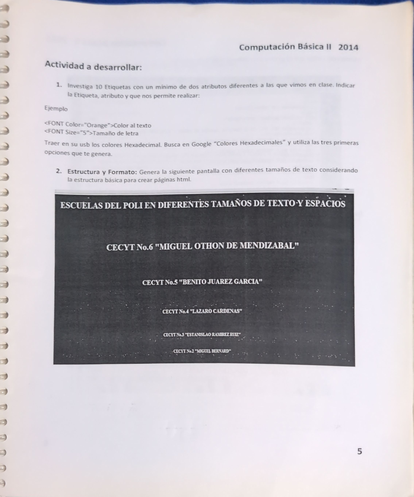
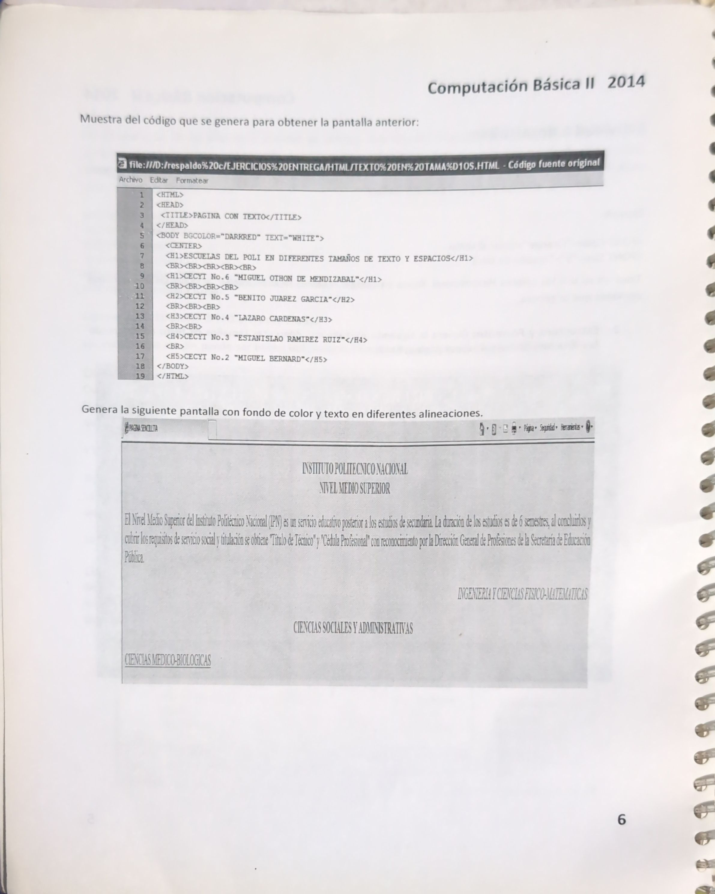

# Actividad 1
generar una pagina web la cual muestre las escuelas del politécnico a nivel medio superior, estas deberán mostrarse en diferentes tamaños donde el el siguiente titulo "Escuelas del Politecnico" utilizando h1 y las escuelas deberán listarse en h2 y h6

Tambien se ofrece el codigo de la actividad a realizar

## Idea a mejorar
- se debera implementar un escroll infinito con el fin de que cuando se llegue a la ultima escuela debera repetirse el ciclo
- anadir el escudo de la escuela a lado de su nombre
- la escuela marcada debera estar diferenciada
- utilice html semantico 
- aplique mejoras de diseño
- reponsiva
# Actividad 2
En lugar de crear un proyecto diferente deberiamos conectar esta hoja que al hacer click sobre el titulo de "escuelas del politecnico" nos muestre la información 

# Actividad 3
Al generar esta pantalla debera mostrar la lista de las carreras ofertadas
